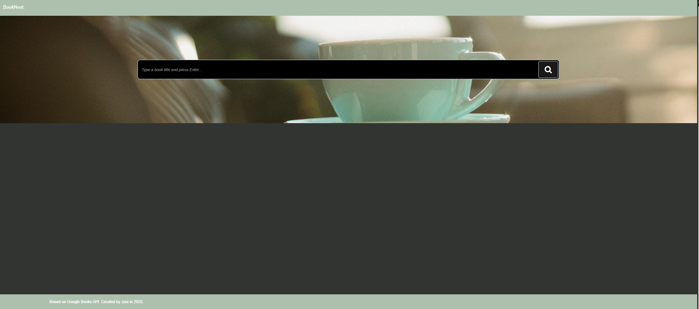
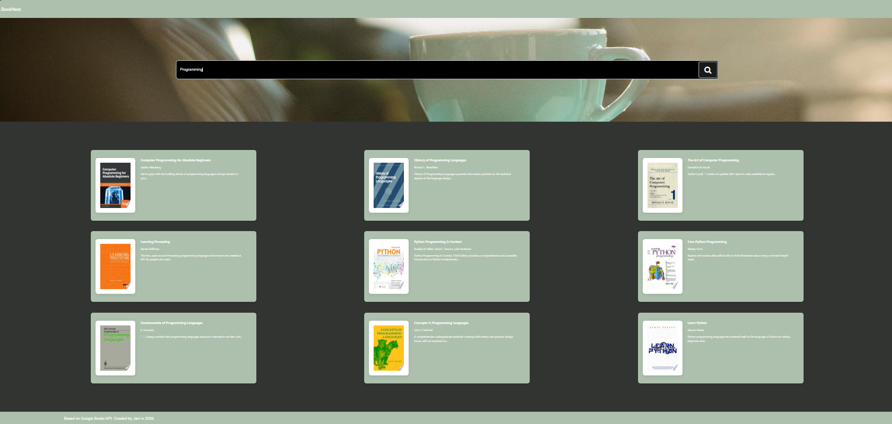
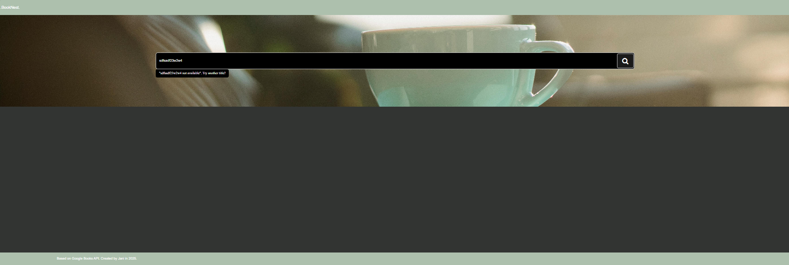

# BookNest – Google Books API based Search App

A simple React app built with **Vite** that allows users to search for books by title using the [Google Books API](https://developers.google.com/books). It features input validation, responsive UI, and detailed book modals. In the UI design, the font, style and colours have been chosen to be mild, calming and have a book reading corner effect.

---

## Tech Stack

  
  
  
  

---

## UI screenshots

# Home page

# Search results

# Search term validation

---

## Features

- Search by title using Google Books API
- Input validation for empty search
- Graceful handling for no search results
- Displays book:
  - Cover image
  - Title
  - Snippet of description
- Modal view with:
  - Book cover
  - Full title
  - Publisher info
  - Link to Google Books for more details

---

## Google Book api

- End point used: https://www.googleapis.com/books/v1/volumes?q=intitle:${encodedSearchTerm}&key=${authKey}&maxResults=${maxResults}
  where, encodedSearchTerm is the search term from user input, authKey is the registered api key at [api console](https://console.developers.google.com/)
  and maxResults is the maximum number of results fitlered from the search, set to 9 for this app.

---

## Code snippets

# Shortens a long description to a 15-word preview.

/\*\*

- Truncates a description to a preview of the first 15 words.
- @param {string} description - The full text description (can be empty).
- @returns {Object} An object containing either the original or a truncated preview description.
  \*/
  export function modifyDescription(description = "") {
  // If no description is provided, return it as-is
  if (!description) {
  return { description };
  }

// Split the description into an array of words
const words = description.split(/\s+/);

// Join the first 15 words back into a string
const previewWords = words.slice(0, 15).join(" ");

// Add ellipsis if original description was longer than 15 words
const previewDescription = words.length > 15 ? previewWords + "..." : previewWords;

return { previewDescription };
}

---

## Tech Stack

- Vite + React (JavaScript)
- React Hooks: `useState`, `useEffect`
- CSS (or Tailwind if used)
- Google Books API

---

## What I learnt

- How to handle fetch and display data from an external API

- Handling boundary cases for input from user

- Using modals to show context-based additional information,
  in this case it is displaying information pertaining to a book when user clicks on the book card.

- Displaying fallback UI for missing or empty data, to ensure application doesn't break on external data fetch errors

## Install instructions

- git clone https://git@github.com:JaniTech2025/GoogleBooks.git
- cd GoogleBooks
- set up environment variable for VITE_API_KEY in .env file
- npm install
- npm run dev
